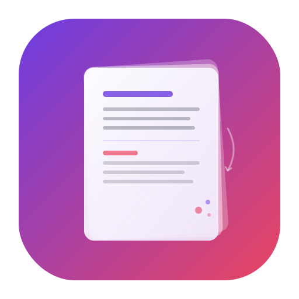
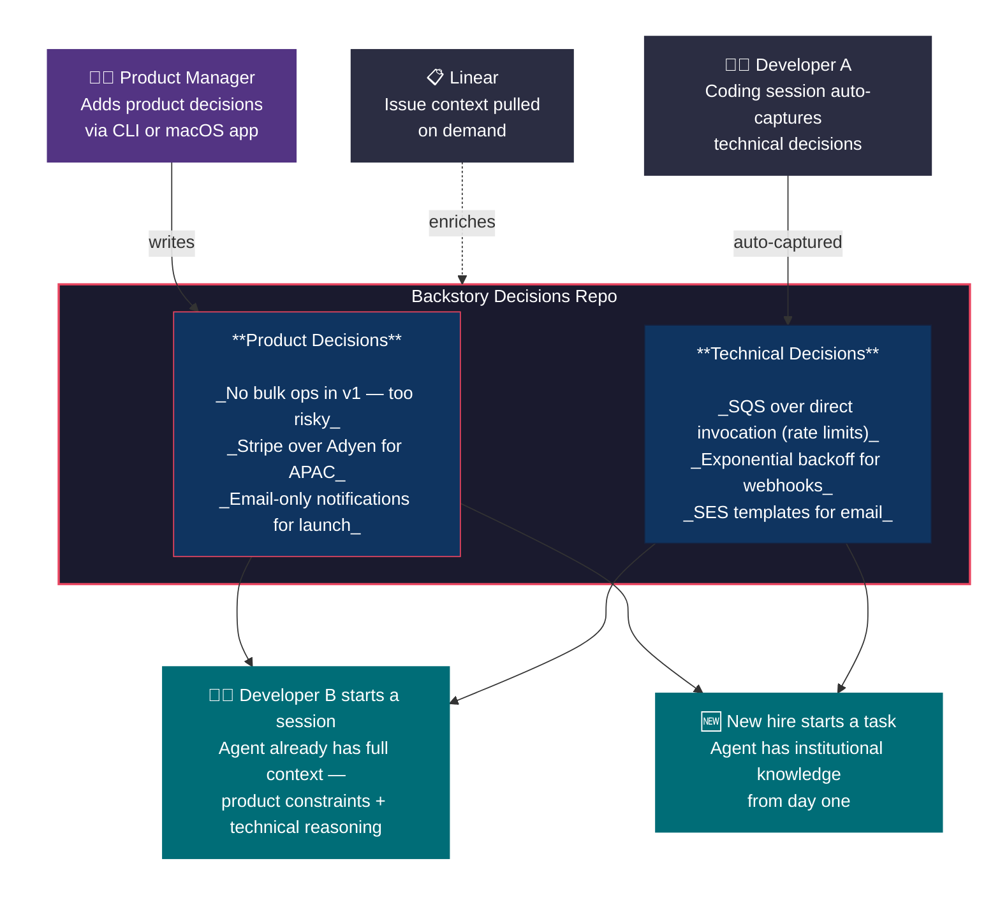
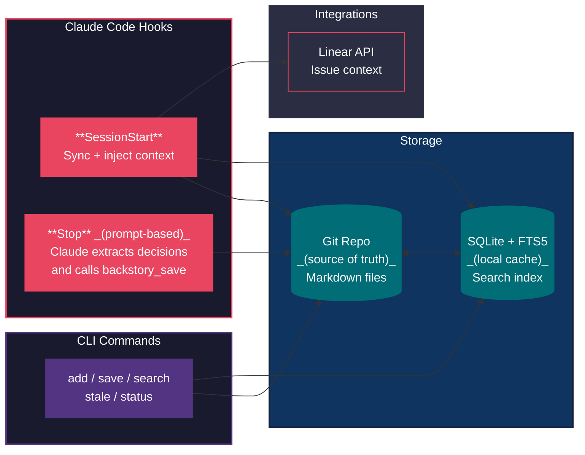

<p align="center">
  
  <h1 align="center">Backstory</h1>
  <p align="center"><strong>The missing link between product decisions and code</strong></p>
  <p align="center">
    <a href="https://github.com/yaronya/backstory/actions"></a>
    <a href="https://goreportcard.com/report/github.com/yaronya/backstory"></a>
    <a href="https://github.com/yaronya/backstory/blob/master/LICENSE"></a>
    <a href="https://github.com/yaronya/backstory/releases"></a>
    
  </p>
</p>

---

Product managers make decisions that shape what gets built. Engineers make decisions that shape how it gets built. Today, these live in different worlds — Slack threads, Linear tickets, PR descriptions, people's heads — and they go stale the moment they're written.

**Backstory keeps them in sync.** It captures the *why* behind every decision — product and technical — and makes it available to everyone's AI coding agent, automatically.

> A PM decides "no bulk operations in v1 — too risky for launch" in a Linear ticket.
>
> A developer starts working on the payment service. Their AI agent already knows: *don't build bulk support, here's why, and here's the ticket.*
>
> Another developer finishes a session where they chose SQS over direct API calls for rate-limit reasons. That reasoning is captured and shared — without them writing a single doc.
>
> Next week, a new hire picks up a related task. Their agent has the full backstory.

## The Problem

Every AI coding session starts from zero. Your agent doesn't know:
- Why the PM chose Stripe over Adyen
- Why the team rejected bulk operations for v1
- Why SQS was picked instead of direct invocation
- What constraints and tradeoffs shaped the current architecture

This context exists somewhere — scattered across Slack, Linear, Google Docs, and people's memories. But it never reaches the AI agent that's writing the code.

**The result:** agents make decisions in a vacuum, engineers re-explain the same context every session, and product intent gets lost in translation.

## How Backstory Fixes This



### For Product Managers

- Add product decisions in plain language: *"We chose Stripe for APAC because of multi-currency support"*
- Decisions flow directly into developer AI agents — no handoff, no lost context
- See what technical decisions the team made and why
- Product intent stays connected to the code, even months later
- No new tools to learn — works through the CLI today, native macOS app coming soon

### For Engineers

- Your AI agent starts every session with the full backstory — product constraints, team decisions, architectural context
- Decisions are captured automatically from your coding sessions — no docs to write
- Search across all team decisions: `backstory search "payment processing"`
- New team members onboard faster — their agent has the institutional knowledge from day one

### For Teams

- Product and technical decisions live in one place, version-controlled and searchable
- No more "why was this built this way?" — the answer is in the backstory
- Knowledge survives team changes — when someone leaves, their decisions stay
- Works like Waze: you benefit by connecting, contribute by working. Nobody "shares" — it just happens.

## Quick Start

```bash
# Install
go install github.com/yaronya/backstory/cmd/backstory@latest

# Create a decisions repo for your team
backstory init --path my-team-decisions

# Or join an existing team's repo
backstory init --connect git@github.com:my-team/decisions.git

# Set the environment variable (add to your shell profile)
export BACKSTORY_REPO=/path/to/my-team-decisions

# Optional: API keys (only needed for macOS app or backstory capture fallback)
cat > /path/to/my-team-decisions/.backstory/config.local.yml << 'EOF'
claude_api_key: sk-ant-...   # Not needed if using Claude Code plugin
linear_api_key: lin_api_...
EOF
```

**Requirements:** Go 1.26+, Git

## Claude Code Integration

Install the [Backstory plugin](plugin/) for Claude Code and every session gets automatic context:

- **Session start:** Syncs latest decisions and injects relevant context
- **Session end:** Claude Code itself reviews the conversation for decisions and saves them via the `backstory_save` MCP tool

**No Claude API key needed for developers.** The Stop hook is prompt-based — Claude Code extracts its own decisions directly, no separate API call required.

The plugin configures hooks automatically. If you prefer manual setup, add to `.claude/settings.json`:

```json
{
  "hooks": {
    "SessionStart": [
      {
        "type": "command",
        "command": "backstory sync && backstory inject"
      }
    ],
    "Stop": [
      {
        "type": "prompt",
        "prompt": "Before ending this session, review the conversation for meaningful architectural or technical decisions. If you find any, use the backstory_save MCP tool to save them."
      }
    ]
  }
}
```

## Adding Product Decisions

PMs (or anyone) can add decisions directly:

```bash
backstory add \
  --type product \
  --anchor payments \
  --linear ENG-892 \
  --title "No bulk operations in v1" \
  "Too risky for initial launch. Single-item operations only. Revisit for v2."
```

This decision immediately appears in every developer's next session when they work on payments.

## What Gets Captured

Backstory distinguishes between two types of decisions:

**Product decisions** — the *what* and *why* from a product perspective:
- "We chose Stripe over Adyen for APAC because of multi-currency support"
- "No bulk operations in v1 — too risky for launch"
- "Email-only notifications for launch, push notifications in v2"

**Technical decisions** — the *how* and *why* from an engineering perspective:
- "Chose SQS over direct invocation because vendor API rate-limits at 100 rps"
- "Added exponential backoff for Stripe webhooks — can delay up to 5 minutes"
- "Used SES templates instead of inline HTML for email maintainability"

Both types are anchored to code paths and Linear issues, so the right context surfaces at the right time.

## Decisions Repo

Backstory stores everything in a dedicated git repo — separate from your code repos. Just markdown files with YAML frontmatter, version-controlled and human-readable.

```
my-team-decisions/
├── product/
│   └── payments/
│       ├── 2026-03-20-stripe-over-adyen.md
│       └── 2026-03-22-no-bulk-ops-v1.md
├── technical/
│   └── backend/services/payment-service/
│       ├── 2026-03-19-sqs-over-direct-invocation.md
│       └── 2026-03-22-exponential-backoff-webhooks.md
└── .backstory/
    └── config.yml
```

**Why a separate repo?**
- No branch protection blocking fast capture — decisions push directly to main
- PMs get access without needing code repo permissions
- One decisions repo serves multiple code repos
- Different lifecycle — decisions are append-mostly, code has branches and releases

## Commands

| Command | Description |
|---------|-------------|
| `backstory init` | Create a new decisions repo or connect to an existing one |
| `backstory add` | Manually add a product or technical decision |
| `backstory search <query>` | Full-text search across all decisions |
| `backstory status` | Show decision counts, stale items, and pending queue |
| `backstory sync` | Pull latest, process pending decisions, rebuild index |
| `backstory index` | Rebuild the local search index |
| `backstory inject` | Output relevant context as XML (used by session hooks) |
| `backstory capture` | Extract decisions from a session transcript (requires API key) |
| `backstory save` | Save pre-extracted decisions from JSON on stdin (used by Claude Code plugin) |
| `backstory stale` | Detect and mark decisions whose anchored code has changed |
| `backstory edit <file>` | Edit a decision and commit the change |

## Configuration

**Team settings** (`.backstory/config.yml` — committed, shared):

```yaml
team: my-team
repos:
  - name: backend
    url: git@github.com:my-team/backend.git
  - name: frontend
    url: git@github.com:my-team/frontend.git
linear:
  team_key: ENG
inject:
  max_decisions: 10
  max_tokens: 2000
extract:
  model: claude-haiku-4-5-20251001
  max_tokens: 4096
```

**Local secrets** (`.backstory/config.local.yml` — gitignored):

```yaml
claude_api_key: sk-ant-...
linear_api_key: lin_api_...
```

## Architecture



## Roadmap

- [ ] **macOS app** — Claude-powered chat interface for PMs to browse, search, and add decisions without touching the terminal
- [ ] **Semantic search** — embedding-based search for "find decisions about error handling" style queries
- [ ] **Slack integration** — pull context from linked Slack threads
- [ ] **Staleness detection v2** — detect when anchored code changes significantly, not just deleted
- [ ] **Agent-agnostic** — MCP server for Cursor, Copilot, and other AI coding tools

## Contributing

Contributions are welcome. Please open an issue to discuss changes before submitting a PR.

```bash
make test    # Run tests
make build   # Build binary
```

## License

[MIT](LICENSE)
